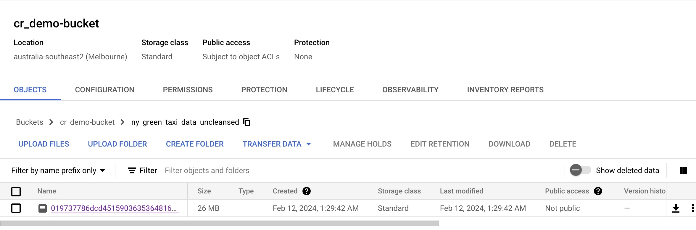

# Week 3 Homework

<details>
  <summary>Requirements</summary>

### Requirements

ATTENTION: At the end of the submission form, you will be required to include a link to your GitHub repository or other public code-hosting site. This repository should contain your code for solving the homework. If your solution includes code that is not in file format (such as SQL queries or shell commands), please include these directly in the README file of your repository.

**Important Note:**

For this homework we will be using the 2022 Green Taxi Trip Record Parquet Files from the New York City Taxi Data found here:

https://www.nyc.gov/site/tlc/about/tlc-trip-record-data.page

If you are using orchestration such as Mage, Airflow or Prefect do not load the data into Big Query using the orchestrator.

Stop with loading the files into a bucket.

NOTE: You will need to use the PARQUET option files when creating an External Table

**SETUP:**

Create an external table using the Green Taxi Trip Records Data for 2022.

Create a table in BQ using the Green Taxi Trip Records for 2022 (do not partition or cluster this table).
</details>

---

# My Solution

I will be using Airflow as my orchestration.

My DAG is as follows:


## The DAG tasks

### Extract

https://github.com/celicaR/de-zoomcamp/blob/main/WK3/airflow/dags/de_zoomcamp/extract_data_from_url.py

The data to be extracted is the NY Green Taxi 2022 data from the given URL, found in the following links:

***Data Source Files***
- https://d37ci6vzurychx.cloudfront.net/trip-data/green_tripdata_2022-01.parquet
- https://d37ci6vzurychx.cloudfront.net/trip-data/green_tripdata_2022-02.parquet
- ...
- https://d37ci6vzurychx.cloudfront.net/trip-data/green_tripdata_2022-12.parquet

This data will be stored as a DataFrame.

### Transform

https://github.com/celicaR/de-zoomcamp/blob/main/WK3/airflow/dags/de_zoomcamp/transform_data.py

Once the NY Green Taxi 2022 data is loaded as a DataFrame then the following transformations will be done:
1. ~~Trips with 0 passangers will be removed.~~
1. ~~Trips with 0 distance will be removed.~~
1. 2 new date columns (`lpep_pickup_date` & `lpep_dropoff_date`) will be derived from the original datetime ones.
1. Columns in Camel Case will be renamed to Snake Case, e.g. `VendorID` will be renamed to `vendor_id`.

Please note for the number to be closer to the given options in the submission, then the 0 passengers and 0 distance trips must be included in the data.

### Load

https://github.com/celicaR/de-zoomcamp/blob/main/WK3/airflow/dags/de_zoomcamp/load_data_to_gcp.py

The transformed NY Green Taxi 2022 data will be loaded un-partitioned to my Google Cloud Storage bucket `cr_demo-bucket/ny_green_taxi_data_uncleansed` as shown:



---

## IN GCP

I created a couple of datasets.

### WK3_de_zoomcamp_dataset - via click ops


<details>
  <summary>External table creation - Click me</summary>

##### External table


</details>

<details>
  <summary>Native table creation - Click me</summary>

##### Native/Materialzed table


</details>

### ny_taxi dataset - via queries


<details>
  <summary>Tables creation queries - Click me</summary>

``` sql
-- Creating external table referring to gcs path
CREATE OR REPLACE EXTERNAL TABLE `ny_taxi.external_green_tripdata_2022`
OPTIONS (
  format = 'parquet',
  uris = ['gs://cr_demo-bucket/ny_green_taxi_data_uncleansed/019737786dcd4515903635364816fba2-0.parquet']
);

-- Check green trip data 
-- This query will process 0 B when run
SELECT * FROM ny_taxi.external_green_tripdata_2022 limit 10;

-- Create a non partitioned table from external table 
-- This query will process 0 B when run
CREATE OR REPLACE TABLE ny_taxi.green_tripdata_2022_non_partitoned AS
SELECT * FROM ny_taxi.external_green_tripdata_2022;

-- Create a partitioned table from external table 
-- This query will process 0 B when run
CREATE OR REPLACE TABLE ny_taxi.green_tripdata_2022_partitoned
PARTITION BY
  DATE(lpep_pickup_datetime) AS
SELECT * FROM ny_taxi.external_green_tripdata_2022;
```
</details>

<details>
  <summary>Impact of partition on queries - Click me</summary>

``` sql
-- This query will process 12.82 MB when run.
SELECT DISTINCT(pulocation_id)
FROM ny_taxi.green_tripdata_2022_non_partitoned
WHERE DATE(lpep_pickup_datetime) BETWEEN '2022-06-01' AND '2022-06-30';

-- This query will process 1.12 MB when run.
SELECT DISTINCT(pulocation_id)
FROM ny_taxi.green_tripdata_2022_partitoned
WHERE DATE(lpep_pickup_datetime) BETWEEN '2022-06-01' AND '2022-06-30';

-- Let's look into the partitions
-- This query will process 10 MB when run.
SELECT table_name, partition_id, total_rows
FROM `ny_taxi.INFORMATION_SCHEMA.PARTITIONS`
WHERE table_name = 'green_tripdata_2022_partitoned'
ORDER BY total_rows DESC;
```
</details>

<details>
  <summary>Impact of creating a table with a partition and a cluster - Click me</summary>

``` sql
-- This query will process 0 B when run.
CREATE OR REPLACE TABLE ny_taxi.green_tripdata_2022_partitoned_clustered
PARTITION BY DATE(lpep_pickup_datetime)
CLUSTER BY pulocation_id AS
SELECT * FROM ny_taxi.external_green_tripdata_2022;

-- This query will process 7.28 MB when run.
SELECT count(*) as trips
FROM ny_taxi.green_tripdata_2022_partitoned
WHERE DATE(lpep_pickup_datetime) BETWEEN '2022-06-01' AND '2022-12-31'
  AND pulocation_id=1;

-- This query will process 1.14 MB when run.
SELECT count(*) as trips
FROM ny_taxi.green_tripdata_2022_partitoned_clustered
WHERE DATE(lpep_pickup_datetime) BETWEEN '2022-06-01' AND '2022-12-31'
  AND pulocation_id=1;
```
</details>

---
<details>
  <summary>Question 5 workings - Click me</summary>

``` sql
-- Write a query to retrieve the distinct PULocationID between lpep_pickup_datetime 06/01/2022 and 06/30/2022 (inclusive)

SELECT DISTINCT(pulocation_id) as trips
FROM ny_taxi.green_tripdata_2022_partitoned_clustered
WHERE DATE(lpep_pickup_datetime) BETWEEN '2022-06-01' AND '2022-06-30';


-- Use the materialized table you created earlier in your from clause and note the estimated bytes. 

-- This query will process 12.82 MB when run.
SELECT DISTINCT(pulocation_id) as trips
FROM WK3_de_zoomcamp_dataset.native_ny_green_taxi_2022_uncleansed_unpartitioned
WHERE DATE(lpep_pickup_datetime) BETWEEN '2022-06-01' AND '2022-06-30';

-- Now change the table in the from clause to the partitioned table you created for question 4 and note the estimated bytes processed. 

-- This query will process 1.12 MB when run.
SELECT DISTINCT(pulocation_id) as trips
FROM ny_taxi.green_tripdata_2022_partitoned
WHERE DATE(lpep_pickup_datetime) BETWEEN '2022-06-01' AND '2022-06-30'
```

What are these values?
- materialized table query will be 12.82 MB 
- partitioned table query will be 1.12 MB

</details>