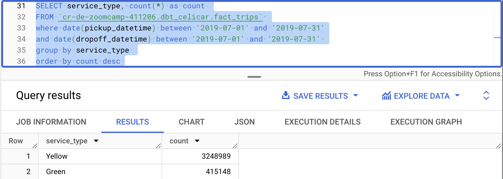

## Set up

NB: NEED TO MOVE TO AIRFLOW BUT RAN OUT OF TIME

<details>
  <summary>URL to GCS - Click me</summary>

### URL to GCS
Tried with Airflow but kept getting zombie tasks due to the time taking when loading the data from the API to GCS.

In the end ran a python script (scripts/url_to_gcs.py - @ & credits acknowledgment in the script) to do load the API files to GCS.
This had problem on a few fields on their own, and the last one when trying to do the FHV analysis got the best of me.

```
TIMESTAMP value is out of allowed range: from 0001-01-01 00:00:00.000000+00 to 9999-12-31 23:59:59.999999+00.
```

#### Resulting GCS


</details>

<details>
  <summary>Loading GCS to BQ - Click me</summary>

### Loading GCS to BigQuery


``` sql
CREATE EXTERNAL TABLE `cr-de-zoomcamp-411206.ny_taxi.green_tripdata`
OPTIONS (
  uris=['gs://cr_demo-bucket/ny_taxi_data/green/green_tripdata_20*.parquet'],
  format ='PARQUET'
);

CREATE EXTERNAL TABLE `cr-de-zoomcamp-411206.ny_taxi.yellow_tripdata`
OPTIONS (
  uris=['gs://cr_demo-bucket/ny_taxi_data/yellow/yellow_tripdata_20*.parquet'],
  format ='PARQUET'
);

CREATE EXTERNAL TABLE `cr-de-zoomcamp-411206.ny_taxi.fhv_tripdata`
OPTIONS (
  uris=['gs://cr_demo-bucket/ny_taxi_data/fhv/fhv_tripdata_20*.parquet'],
  format ='PARQUET'
);
```

#### Resulting BQ


</details>

<details>
  <summary>DBT Models Generation - Click me</summary>

### DBT Models Generation

Trying to generate models - no luck
```

{{ codegen.generate_model_yaml(model_names = models_to_generate) 
}}
```

</details>

<details>
  <summary>DBT Compile and Build - Click me</summary>

  #### Compile and Build results


</details>

<details>
  <summary>DBT Staging and Lineage - Click me</summary>

  #### Staging and Lineage results


</details>

<details>
  <summary>DBT BQ Results - Click me</summary>

  #### DBT BQ Results


</details>

===

## Actions taken
- After setting up my dbt account I followed the [dbt <> BigQuery setup](https://github.com/DataTalksClub/data-engineering-zoomcamp/blob/main/04-analytics-engineering/dbt_cloud_setup.md)
- I had a few issues with GitHub but once I created in GitHub my branch to use in DBT and disallowed Allow merge commits, it started working
- Although I tried for a few days with all the issues loading the data, the quality of it and the deadline (Thank you for the extension!) I feel really sad I could not complete the homework. Love the style of teaching, the detailed notes and videos. Just took too long trying to get it all working with Airflow!
- Continue trying to answer questions 3 & 4 today - 25/2/24, and I got it. However, I don't have access to a free tier of looker and/or access to data studio either!

<details>
  <summary>Final Set up - Click me</summary>

  #### Final Set up 


</details>

<details>
  <summary>Question 3 Queries - Click me</summary>

  #### BQ Query
``` sql
SELECT count(*) FROM `cr-de-zoomcamp-411206.dbt_celicar.fact_fhv_trips`
```


#### Answer I chose was 12,998,722, but the actual count was 17,876,888.  
</details>

<details>
  <summary>Question 4 Queries - Click me</summary>

  #### Fact FHV trips Query

``` sql
SELECT service_type, COUNT(*) as count 
FROM `cr-de-zoomcamp-411206.dbt_celicar.fact_fhv_trips` 
WHERE DATE(pickup_datetime) BETWEEN '2019-07-01' AND '2019-07-31'
AND DATE(dropoff_datetime) BETWEEN '2019-07-01' AND '2019-07-31' 
GROUP BY service_type 
ORDER BY count DESC 
```


  #### Fact trips Query
``` sql
SELECT service_type, COUNT(*) AS count 
FROM `cr-de-zoomcamp-411206.dbt_celicar.fact_trips` 
WHERE DATE(pickup_datetime) BETWEEN '2019-07-01' AND '2019-07-31'
AND DATE(dropoff_datetime) BETWEEN '2019-07-01' AND '2019-07-31' 
GROUP BY service_type 
ORDER BY count DESC 
```



#### Answer is YELLOW.
</details>

